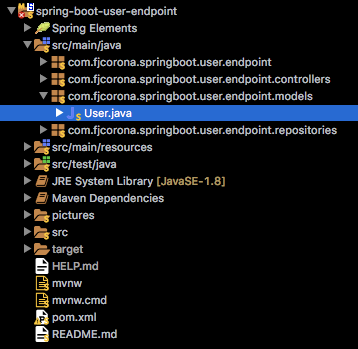

# _Menu_

* [_Introduction_](#introduction)
* [_Application Properties_](#application-properties)
	* [_Application Name_](#application-name) 
	* [_Port_](#port)
	* [_JPA Show SQL_](#jpa-show-sql)
	* [_JPA Format SQL_](#jpa-format-sql)
* [_Dependencies_](#dependencies)
	* [_Spring Boot Web Starter_](#spring-boot-web-starter)
	* [_Spring Boot Developer Tools_](#spring-boot-developer-tools)
	* [_Spring Boot Data JPA Starter_](#spring-boot-data-jpa-starter)
	* [_H2 Database Engine_](#h2-database-engine)
	* [_Spring Boot Test Starter_](#spring-boot-test-starter)
	* [_JUnit_](#junit)
* [_Database_](#database)
	* [_Database Feeding_](#database-feeding)
	* [_CREATE Query_](#create-query)
* [_Bean_](#bean)
	* [_Entity_](#entity) 
	* [_Column_](#column)
	* [_Primary Key_](#primary-key)
* [_Repository_](#repository)
	* [_findAll_](#findall)
	* [_findById_](#findbyid)
	* [_save_](#save)
		* [_With NULL id_](#with-null-id)
		* [_With NOT NULL id_](#with-not-null-id)
	* [_deleteById_](#deletebyid)
	* [_findByActive_](#findbyactive)
	* [_findByActiveAndId_](#findbyactiveandid)
* [_User Controller_](#user-controller)
	* [_Get All Users_](#get-all-users)
	* [_Get User By Id_](#get-user-by-id)
	* [_Create User_](#create-user)
	* [_Update User_](#update-user)
	* [_Delete User_](#delete-user)
	* [_Get All Active Users_](#get-all-active-users)
	* [_Get Active User By Id_](#get-active-user-by-id)
	* [_Activate/Deactivate User_](#activatedeactivate-user)
* [_Test Endpoints_](#test-endpoints)
	* [_Get All Users_](#get-all-users-1)
	* [_Get User By Id_](#get-user-by-id-1)
	* [_Add User_](#add-user)
	* [_Update User_](#update-user-1)
	* [_Delete User_](#delete-user-1)
	* [_Get All Active Users_](#get-all-active-users-1)
	* [_Get Active User By ID_](#get-active-user-by-id-1)
	* [_Get All Inactive Users_](#get-all-inactive-users-1)
	* [_Get Inactive User By ID_](#get-inactive-user-by-id-1)
	* [_Active User_](#active-user)
	* [_Deactive User_](#deactive-user)
	* [_Import Collection_](#import-collection)

# _Introduction_

This project is especially focused on beginners like me, for all those who just want to know a quick and simple way to create microservices with Spring Boot.

Here is a small example in which you will be able to perform CRUD operations for users, as well as activate and deactivate them. All this in a very isolated way to a graphical interface, the way it will be done is through endpoints with REST requests, which can be consumed from any application or client that has the capacity to consume them. We will test the endpoints with Postman.

[](#menu)

# _Application Properties_

When we are working with Spring Boot, we have an [_application.properties_](src/main/resources/application.properties) file, here we can make some important configurations. There are some configurations which Spring Boot understand by default, but there are another ones that we have to explicity set in the file.


For this project we will set just four properties.

[](#menu)

## _Application Name_

The variable `spring.application.name` set the application name and indicates the name of the file in the GIT repository where the settings were sought.

This is the way to set the property at file:

```properties
spring.application.name=user-endpoint-service
```

[](#menu)

## _Port_

The default port in which a Spring Boot application runs is ___8080___. In the case we want to change this default port, we have to set `server.port` variable: 

```properties
server.port=8888
```

I've selected the ___8888___ port, this way, my microservices will run in the next URL:

[_http://localhost:8888_](http://localhost:8888)

[](#menu)

## _JPA Show SQL_

When the project is executed, there is a log, in which the errors are shown as well as some relevant information about our application. Thanks to the property `spring.jpa.show-sql` we have the possibility to see the queries related to our temporary database.

```properties
spring.jpa.show-sql=true
```

We just set the property as true, if we don't set this property, by default is false and no query is going to be shown. Later we will see some examples.

[](#menu)

## _JPA Format SQL_

This property works together with the previous property, because although, the previous property shows the queries, it doesn't make a nice format. That's where `spring.jpa.properties.hibernate.format_sql` comes into action to achieve that goal.

```properties
spring.jpa.properties.hibernate.format_sql=true
```

In the same way, this property by default is false, so we have to set it as true.

Later we will see some examples of both properties working together.

[](#menu)

# _Dependencies_

As we can see at the structure, this project has been made under maven. That's why we need to add some dependencies to perform.

We can find those dependencies at [_pom.xml_](pom.xml)

[](#menu)

## _Spring Boot Web Starter_

Starter for building web, including RESTful, applications using Spring MVC. Uses Tomcat as the default embedded container.

```xml
<!-- https://mvnrepository.com/artifact/org.springframework.boot/spring-boot-starter-web -->
<dependency>
	<groupId>org.springframework.boot</groupId>
	<artifactId>spring-boot-starter-web</artifactId>
</dependency>
```

[](#menu)

## _Spring Boot Developer Tools_

Spring Boot includes an additional set of tools that can make the application development experience a little more pleasant. The `spring-boot-devtools` module can be included in any project to provide additional development-time features.

```xml
<!-- https://mvnrepository.com/artifact/org.springframework.boot/spring-boot-devtools -->
<dependency>
	<groupId>org.springframework.boot</groupId>
	<artifactId>spring-boot-devtools</artifactId>
	<scope>runtime</scope>
</dependency>
```

[](#menu)

## _Spring Boot Data JPA Starter_

Spring Boot Starters are a set of convenient dependency descriptors that you can include in your application. You get a one-stop-shop for all the Spring and related technology that you need without having to hunt through sample code and copy paste loads of dependency descriptors. For example, if you want to get started using Spring and JPA for database access just include the `spring-boot-starter-data-jpa` dependency in your project, and you are good to go.

```xml
<!-- https://mvnrepository.com/artifact/org.springframework.boot/spring-boot-starter-data-jpa -->
<dependency>
	<groupId>org.springframework.boot</groupId>
	<artifactId>spring-boot-starter-data-jpa</artifactId>
</dependency>
```

[](#menu)

## _H2 Database Engine_

H2 is a relational database management system written in Java. It can be embedded in Java applications or run in client-server mode.
It is possible to create in-memory tables.

```xml
<!-- https://mvnrepository.com/artifact/com.h2database/h2 -->
<dependency>
	<groupId>com.h2database</groupId>
	<artifactId>h2</artifactId>
	<scope>runtime</scope>
</dependency>
```

[](#menu)

## _Spring Boot Test Starter_

Starter for testing Spring Boot applications with libraries including JUnit, Hamcrest and Mockito.

```xml
<!-- https://mvnrepository.com/artifact/org.springframework.boot/spring-boot-starter-test -->
<dependency>
	<groupId>org.springframework.boot</groupId>
	<artifactId>spring-boot-starter-test</artifactId>
	<scope>test</scope>
</dependency>
```

[](#menu)

## _JUnit_

JUnit is a regression testing framework written by Erich Gamma and Kent Beck. It is used by the developer who implements unit tests in Java. For the moment we will not be focused in testing.

```xml
<!-- https://mvnrepository.com/artifact/junit/junit -->
<dependency>
	<groupId>junit</groupId>
	<artifactId>junit</artifactId>
	<version>4.12</version>
	<scope>test</scope>
</dependency>
```

[](#menu)

# _Database_

As it was mentioned before ___H2 Engine___ is the _RDBMS_ we will use to persist our information. Due to it supplies us with the advantaje to make in-memory tables. It means that we don't really need to install nothing because we will have a Runtime database, which will be deleted once the execution of the application finishes. What doesn't mean a problem for learning effects. You should easily change H2 for annother database management such as ***MySQL*** or ***PostgreSQL***.

We make the assumption we are working with JPA.

[](#menu)

## _Database Feeding_

By default, spring boot reads the [_data.sql_](src/main/resources/data.sql) file located at ___resources___ folder to create our temporal database.


It is as simple as declare `INSERT` queries with the table, the fields and the info we need:

<details>
    <summary>data.sql</summary>

```sql
INSERT INTO users (usr_id, usr_name, usr_lastname, usr_age, usr_active)
VALUES (10001, 'Javier', 'Corona', 30, 1);
INSERT INTO users (usr_id, usr_name, usr_lastname, usr_age, usr_active)
VALUES (10002, 'Francisco', 'Sánchez', 29, 1);
INSERT INTO users (usr_id, usr_name, usr_lastname, usr_age, usr_active)
VALUES (10003, 'Alejandra', 'López', 25, 0);
INSERT INTO users (usr_id, usr_name, usr_lastname, usr_age, usr_active)
VALUES (10004, 'Fernanda', 'Parra', 32, 1);
INSERT INTO users (usr_id, usr_name, usr_lastname, usr_age, usr_active)
VALUES (10005, 'Humberto', 'Lisboa', 22, 1);
INSERT INTO users (usr_id, usr_name, usr_lastname, usr_age, usr_active)
VALUES (10006, 'Paola', 'Duarte', 33, 1);
INSERT INTO users (usr_id, usr_name, usr_lastname, usr_age, usr_active)
VALUES (10007, 'Ernesto', 'Duarte', 33, 0);
INSERT INTO users (usr_id, usr_name, usr_lastname, usr_age, usr_active)
VALUES (10008, 'Filemón', 'Hernández', 25, 0);
INSERT INTO users (usr_id, usr_name, usr_lastname, usr_age, usr_active)
VALUES (10009, 'Pantaleón', 'Pérez', 23, 1);
INSERT INTO users (usr_id, usr_name, usr_lastname, usr_age, usr_active)
VALUES (10010, 'Serafino', 'Arriaga', 44, 1);
```

</details>

I want to mention a particular field in the table, I'm talking about ***usr_active***, its purpose is to work as a kind of boolean value, where:

|Numeric Value|Boolean Value|Meaning|
|:----:|:----:|:----:|
|0|False|Inactive
|1|True|Active

It must be remembered that in addition to CRUD performance, operations will be implemented to deactivate users, without the need to eliminate them, as well as to reactivate them.

[](#menu)

## _CREATE Query_

Once the application is executed, the SQL file before fed, is read, and according to the names and values ​​given in the `INSERT` queries, a ___users___ table is created with the fields and their respective data types. The next `CREATE` query is internally exectuted:

```sql
DROP TABLE users IF EXISTS
CREATE TABLE users (
	usr_id INTEGER GENERATED BY DEFAULT AS IDENTITY,
	usr_active INTEGER NOT NULL,
	usr_age INTEGER NOT NULL,
	usr_lastname VARCHAR(255) NOT NULL,
	usr_name VARCHAR(255) NOT NULL,
	PRIMARY KEY (usr_id)
)
```

We can check it with the following screenshot of the log, where we can see how the table is created using ___Hibernate___.

Remember we can see it due to `spring.jpa.show-sql` and `spring.jpa.properties.hibernate.format_sql` has been set as _true_.


As it was mentioned, data types are made according to the values they are feed with. We can observe too that `VARCHAR` fields get by default 255 length.
The definition of the files as `NOT NULL` or `PRIMARY KEY`are not from the SQL file, but there are from the annotations in the been, as we will see in the next section.

[](#menu)

# _Bean_

Now we need a Bean, I mean, a Java class which will be mapped with the database `users` table. So we'll need such class with the same or similar name than the table, and properties related with the fields of the table. Of course we need a property by each field, with the same data types, and the same or similar name.

Besides that, the class has to have the getters and setters methods. They are not included in the below definition of code. But you can find the complete code in [_User.java_](src/main/java/com/fjcorona/springboot/user/endpoint/models/User.java) file.



In this bean we use some annotations form `javax.persistence` package.

<details>
	<summary>User.java</summary>
	
```java
package com.fjcorona.springboot.user.endpoint.models;

import javax.persistence.Column;
import javax.persistence.Entity;
import javax.persistence.GeneratedValue;
import javax.persistence.GenerationType;
import javax.persistence.Id;
import javax.persistence.Table;

@Entity
@Table(name = "users")
public class User {

	@Id
	@GeneratedValue(strategy = GenerationType.IDENTITY)
	@Column(name = "usr_id", nullable = false)
	private Integer id;

	@Column(name = "usr_name", nullable = false)
	private String name;

	@Column(name = "usr_lastname", nullable = false)
	private String lastname;

	@Column(name = "usr_age", nullable = false)
	private Integer age;

	@Column(name = "usr_active", nullable = false)
	private Integer active;

	public User() {
	}

	/*
	 * Insert Getters, Setters and Constructors Here
	 * /

}
```	
	
</details>

[](#menu)

## _Entity_

`@Entity` annotation defines that a class can be mapped to a table. Table name is derived from entity class name, it means that, for example, in this case, due to the name ___User___ of the clase, JPA automatically would try to match with a ***user*** table, but our table is called _**users**_, in plural, in this case we have to explicity indicate to the class, which table has to map, this is possible through `@Table` annotation:

```java
@Table(name = "users")
public class User {
	// Code here
}
```

This way ___User___ class knows that is mapped with ***users*** table.

[](#menu)

## _Column_

In the same way table's columns are derived from entities properties, so by default JPA will look for the names of your properties as fields of the table you indicate the Entity it is. As you can see, in the database the fields names has an **usr_** prefix that the class properties don't have, so we need the `@Column` annotation to explicity indicate property by property which field tables will be linked with.

```java
@Column(name = "usr_name", nullable = false)
private String name;
```

This way, ___name___ property knows that is mapped with ***usr_name*** field. And so for each _property/field_ pair.

You might think that the best would be for the table to have the same name as the class and that the fields should also have the same name as the properties and thus avoid these two optional annotations in our code. And maybe that is the best solution, but the difference of names has been made purposely for didactic purposes.

For this annotation there is another point that I would like to emphasize, you can see that in addition to name, another parameter `nullable = false` is being set, this is what results in the fields of our temporary table being created as `NOT NULL`.

[](#menu)

## _Primary Key_

The `@Id` annotation is inherited from `javax.persistence.Id` indicating the member field below is the ___primary key___ of the current entity.

The `@GeneratedValue` annotation is to configure the way of increment of the specified ___primary key___.

The `GenerationType.IDENTITY` is the easiest strategy to use. It relies on an _auto-incremented_ database column and lets the database generate a new value with each insert operation.

This both annotations together, will supply us with and ___id___ autoincremental primary key:

```java
@Id
@GeneratedValue(strategy = GenerationType.IDENTITY)
@Column(name = "usr_id", nullable = false)
private Integer id;
```
An they both are the reason of the primary key in create quey we've seen before.

Something we have to consider and never forget is that the `@Entity` annotation, together with `@Id` annotation is the minimum we need in order to create an entity.

[](#menu)

# _Repository_

We have this implementation in [_UserRepository.java_](src/main/java/com/fjcorona/springboot/user/endpoint/repositories/UserRepository.java) file.


<details>
	<summary>UserRepository.sql</summary>

```java
package com.fjcorona.springboot.user.endpoint.repositories;

import java.util.List;
import java.util.Optional;
import org.springframework.data.jpa.repository.JpaRepository;
import com.fjcorona.springboot.user.endpoint.models.User;

public interface UserRepository extends JpaRepository<User, Integer> {
	// Retrieve a list of all existent "User"
	List<User> findAll();
	
	// Retrieve on "User" by id, in case is found
	Optional<User> findById(Integer id);
	
	// Add/Update a User entity
	@SuppressWarnings("unchecked")
	User save(User user);
	
	// Delete user by Id
	void deleteById(Integer id);
	
	// Retrive the list of active users: findByActive(1), or inactive: findByActive(0)
	public List<User> findByActive(Integer active);
	
	// Retrieve one Active User by Id findByActiveAndId(1, :id)
	Optional<User> findByActiveAndId(Integer active, Integer id);
}
```

</details>

Spring Data JPA provides a repository programming model that starts with an interface per managed domain object.

When we make `JpaRepository<User, Integer>` we indicate that ___JPARepository___ will work with entities of ***User*** type, whose id is *__Integer__* type.

By extending JpaRepository we get at a bunch of generic CRUD methods into our type that allows saving Users, deleting them and so on.

[](#menu)

## _findAll_

This method gets a List of all available entities in database.

```java
List<User> findAll();
```

Remember our ***JPARepository*** was initialized with ___User___ type, so we will get a list of users, wheter they are active or inactive.

It's as if you execute the following sql query:

```sql
SELECT 
	usr_id id,
	usr_name name,
	usr_lastname lastname,
	usr_age age,
	usr_active active 
FROM 
	users;
```

[](#menu)

## _findById_

We expect a single result Entity, ___User___ has been specified as a return type.

```java
Optional<User> findById(Integer id);
```

The method internally executes an SQL query similar to the following:

```sql
SELECT 
	usr_id id,
	usr_name name,
	usr_lastname lastname,
	usr_age age,
	usr_active active 
FROM 
	users;
WHERE
	usr_id = ?
```

Where `?` simbol represents the id owned by the user we are looking for.
Given that the id is a primary key, that is, a unique value to identify the user, we can be sure that if it exists, we will only obtain one user, otherwise the method will not return any user, that is why the return of the function is an ___Optional___ type.

[](#menu)

## _save_

The next method is `save`, as you can see we receive the User entity we want to save.

```java
User save(User user);
```
### _With NULL id_

By default the repository implementation will consider an entity new if its `id` property is `null` in which case, the method internally executes:

```sql
INSERT
INTO 
	users 
		(usr_id, usr_active, usr_age, usr_lastname, usr_name) 
	VALUES 
		(null, ?, ?, ?, ?)
```

The id of the new entity will be automatically assigned, remember is an auto incremetal primary key. And of course, each `?` simbol is related with each property value from the entity.

The method will return a ___User___ instance with the saved values and the generated id.

### _With NOT NULL id_

When the received ___User___ entity has actually a value in its `id` property. The method will `UPDATE` the entity corresponding to the received id.

As outcome, this time `save` method executes the next query:

```sql
UPDATE
	users 
SET
	usr_active=?,
	usr_age=?,
	usr_lastname=?,
	usr_name=? 
WHERE
	usr_id=?
```

The method will return a ___User___ instance with the updated values.

[](#menu)

## _deleteById_

This method just receives the id owned by the user we want to delete.

```java
void deleteById(Integer id);
```
The next SQL Query is internally executed:

```sql
DELETE
	FROM
		users
	WHERE
		usr_id=?
```

[](#menu)

## _findByActive_

JPA provides us with the ability to know what properties our entity has, and from them, our repository can access methods like `findByXx`, where `Xx` represents the name of any of our entity properties.

Taking advantage of this flexibility, we use the `findByActive` method which will bring us a list of all ___User___ instances, active or inactive, depending on the value that the method receives (1 = Active, 0 = Inactive).

```java
public List<User> findByActive(Integer active);
```
Next would be the generic SQL query:

```sql
SELECT 
	usr_id id,
	usr_name name,
	usr_lastname lastname,
	usr_age age,
	usr_active active 
FROM 
	users;
WHERE
	usr_active=?
```

[](#menu)

## _findByActiveAndId_

In the same way that we can use method `findByXx`, JPA flexibility let us to acces to methods `findByXxAndYy` style where `Xx` and `Yy` are two different fields from the table.

This way we can access to the method _findByActiveAndId_ to be more specific an get one active or inactive user by the related id.

```java
Optional<User> findByActiveAndId(Integer active, Integer id);
```

The return type is an ***Optional***, if a user with that conditions is found, a ___User___ entity will be retrived.

The internal query is:

```sql
SELECT 
	usr_id id,
	usr_name name,
	usr_lastname lastname,
	usr_age age,
	usr_active active 
FROM 
	users;
WHERE
	usr_active=?
AND
	usr_id=?
```

[](#menu)

# _User Controller_

The next we need is a Rest Controller, a class that helps us to interact with our database by sending information from outside to inside, and getting it from the inside to outside, through REST requests.

In the next section code, we can see only the structure, but we can find the whole implementation at [UserController.java](src/main/java/com/fjcorona/springboot/user/endpoint/controllers/UserController.java) file, in the same way we will see the code when we review method by method in the next sections.

<details>
	<summary>UserController.java</summary>

```java
package com.fjcorona.springboot.user.endpoint.controllers;

import java.util.List;
import java.util.Optional;

import org.springframework.beans.factory.annotation.Autowired;
import org.springframework.web.bind.annotation.DeleteMapping;
import org.springframework.web.bind.annotation.GetMapping;
import org.springframework.web.bind.annotation.PathVariable;
import org.springframework.web.bind.annotation.PostMapping;
import org.springframework.web.bind.annotation.PutMapping;
import org.springframework.web.bind.annotation.RequestBody;
import org.springframework.web.bind.annotation.RestController;

import com.fjcorona.springboot.user.endpoint.models.User;
import com.fjcorona.springboot.user.endpoint.repositories.UserRepository;

@RestController
public class UserController {
	@Autowired
	private UserRepository repository;

	@GetMapping("/users")
	public List<User> retriveAllUsers() { /* ... */ }
	
	@GetMapping("/users/{id}") { /* ... */ }
	
	@PostMapping("/users")
	public User createUser(@RequestBody User user) { /* ... */ }
	
	@PutMapping("/users/{id}")
	public User updateUser(@RequestBody User user, @PathVariable Integer id) { /* ... */ }

	@DeleteMapping("/users/{id}")
	public void deleteUser(@PathVariable Integer id) { /* ... */ }
	
	@GetMapping("/users-active")
	public List<User> retriveAllActiveUsers() { /* ... */ }
	
	@GetMapping("/users-active/{id}")
	public User retriveOneActiveUserById(@PathVariable Integer id) { /* ... */ }
	
	@GetMapping("/users-inactive")
	public List<User> retriveAllInactiveUsers() { /* ... */ }
	
	@GetMapping("/users-inactive/{id}")
	public User retriveOneInActiveUserById(@PathVariable Integer id) { /* ... */ }
		
	@PutMapping("/users/active/{id}")
	public User activeUser(@PathVariable Integer id) { /* ... */ }
	
	@PutMapping("/users/deactive/{id}")
	public User deactiveUser(@PathVariable Integer id) { /* ... */ }

	private User activeDeactiveUser(Integer id, Integer active) { /* ... */ }
}
```

</details>

`@RestController` is a specialized version of the controller. It includes the `@Controller` and `@ResponseBody` annotations and as a result, simplifies the controller implementation This way we can handle our REST requests.

Every request handling method of the controller class automatically serializes return objects into _HttpResponse_. This way we can send and return _JSON_ information without add any other annotation.

[](#menu)

## _Get All Users_

This is maybe, the easiest implemented request, the only thing we need to do is call the [___findAll___](#findall) method from our repository and return wherever result we get, without further validation, beacuse in the worst of the cases we will get an empty array, in case all goes well we'll get an array of all users. We will see the result when test the methods.

```java
@GetMapping("/users")
public List<User> retriveAllUsers() {
	// Get all users entities
	List<User> users = repository.findAll();
	// Return found users
	return users;
}
```

By annotating method with `@GetMapping("/users")` we define a GET request at [___`http:localhost/8888/users`___](http:localhost/8888/users)

[](#menu)

## _Get User By Id_

If what you want is to obtain a particular user, all you have to do is send the corresponding id to the user we are looking for through the url:

[___`http:localhost/8888/user/{id}`___](http:localhost/8888/user/{id})

Once again the annotation `@GetMapping` is responsible for defining our GET request, but now we indicate that our URL will receive the user's id, and that it'll also change dynamically according to the user we are looking for.

The way to indicate in the route that we will receive a variable value is by putting it between curly braces. In this way, the URL pattern knows that there is a dynamically changing value.

As we can see each URL has a method handler. There we must declare a parameter with the same name as in the URL where we indicate the type of expected data, in addition to annotating it with `@PathVariable`, this way the method knows that _`id`_ receives the value from _`{id}`_ at URL.

In this way, if for example, we search for the user with id _`10001`_, our route would be:

[___`http:localhost/8888/user/10001`___](http:localhost/8888/user/10001)

```java
@GetMapping("/users/{id}")
public User retriveOneUserById(@PathVariable Integer id) {
	// Look for the specific User
	Optional<User> user = repository.findById(id);
	// Return user if it was found, otherwise return an empty instance
	return (user.isPresent()) ? user.get() : new User();
}
```

Once in the method, [***findById***](#findById) method is called with the received id. Remember that the expected value is an optional. If the user was found, we will return the instance from the optional, otherwise a new _`User`_ instance with __*null*__ values ​​will be returned. Later custom responses will be returned for these cases.


[](#menu)

## _Create User_

To create a new user it's necessary to use a HTTP Request POST type at URL [___`http:localhost/8888/user`___](http:localhost/8888/user), this is achieved thanks to the `@PostMapping` annotation.

This URL will receive an object with the user data that we want to add: name, lastname and age. For this purpose the handler method receives a user object of type _`User`_, annotated with `@RequestBody`.

```java
@PostMapping("/users")
public User createUser(@RequestBody User user) {
	// By default a new user is active
	user.setActive(1);
	// Insert the new user and save it
	User savedUser = repository.save(user);
	// Return the inserted user
	return savedUser;
}
```

I'm pretty sure you had noticed that, previously, when mentioning the user data that would be saved, neither ___id___ nor *__active__* were mentioned.

When you want to save a new user, by default it will be **active**, therefore, it's not necessary to receive such property, but we directly do _`user.setActive(1)`_ to save it as an active.

Once the object is prepared, we send it to the [***save***](#save) method of our repository. Remember that by sending the ___id___ property as ***null***, the method understands that a new user must be saved and as a result returns a new _`User`_ object that already includes our _`active`_ property with __1__ and the self-generated _`id`_ with an autogenerated value. This new object will be the one that our URL will return.

[](#menu)

## _Update User_

<details>
	<summary>updateUser</summary>
	
```java
@PutMapping("/users/{id}")
public User updateUser(@RequestBody User user, @PathVariable Integer id) {
	// Look for the user we want to update
	Optional<User> userOptional = repository.findById(id);

	// In case User doesn't exist, return an empty instance
	if (!userOptional.isPresent()) {
		new User();
	}

	// Set received user with the received id
	user.setId(id);
	// Set received user with the status from the found user
	user.setActive(userOptional.get().getActive());

	// Save user
	User savedUser = repository.save(user);

	// Return saved user
	return savedUser;
}
```

</details>

[](#menu)

## _Delete User_

<details>
	<summary>deleteUser</summary>

```java
@DeleteMapping("/users/{id}")
public void deleteUser(@PathVariable Integer id) {
	// Look for the user we want to update
	Optional<User> userOptional = repository.findById(id);

	// In case User exists delete it
	if (userOptional.isPresent()) {
		// Delete user
		repository.deleteById(id);
	}
}
```
</details>

[](#menu)

## _Get All Active Users_

```java
@GetMapping("/users-active")
public List<User> retriveAllActiveUsers() {
	// Send 1 to get all active users
	List<User> users = repository.findByActive(1);
	// Return all active users
	return users;
}
```

[](#menu)

## _Get Active User By Id_

```java
@GetMapping("/users-active/{id}")
public User retriveOneActiveUserById(@PathVariable Integer id) {
	// Look for the active user related wit the received id
	Optional<User> user = repository.findByActiveAndId(1, id);
	// Return user if it was found, otherwise return an empty instance
	return (user.isPresent()) ? user.get() : new User();
}
```

[](#menu)

## _Get All Inactive Users_

```java
@GetMapping("/users-inactive")
public List<User> retriveAllInactiveUsers() {
	// Send 0 to get all inactive users
	List<User> users = repository.findByActive(0);
	// Return all active users
	return users;
}
```

[](#menu)

## _Get Inactive User By Id_

```java
@GetMapping("/users-inactive/{id}")
public User retriveOneInactiveUserById(@PathVariable Integer id) {
	// Look for the inactive user related wit the received id
	Optional<User> user = repository.findByActiveAndId(0, id);
	// Return user if it was found, otherwise return an empty instance
	return (user.isPresent()) ? user.get() : new User();
}return (user.isPresent()) ? user.get() : new User();
}
```

[](#menu)

## _Activate/Deactivate User_

```java
@PutMapping("/users/active/{id}")
public User activeUser(@PathVariable Integer id) {
	// Active user with the received id
	return this.activeDeactiveUser(id, 1);
}
```

```java
@PutMapping("/users/deactive/{id}")
public User deactiveUser(@PathVariable Integer id) {
	// Deactive user with the received id
	return this.activeDeactiveUser(id, 0);
}
```

<details>
	<summary>activeDeactiveUser</summary>

```java
private User activeDeactiveUser(Integer id, Integer active) {
	// Look for the user we want to update
	Optional<User> userOptional = repository.findById(id);

	// In case User doesn't exist, return an empty instance
	if (!userOptional.isPresent()) {
		return new User();
	}

	// Get user found
	User user = userOptional.get();

	// Set found user with the received id
	user.setId(id);
	// Set found user with the received active
	user.setActive(active);

	// Save user
	User savedUser = repository.save(user);

	// Return saved user
	return savedUser;
}
```

</details>

[](#menu)

# _Test Endpoints_

[](#menu)

## _Get All Users_

We just consume the next endpoint

___GET:___ `http:localhost/8888/users`

As a result, we obtain all the users with whom we initialize our database. But this time in ___JSON___ format, through which it is simpler and more standard to establish communication with any application that could consume our service.

<details>
	<summary>Response</summary>

```json
[
    {
        "id": 10001,
        "name": "Javier",
        "lastname": "Corona",
        "age": 30,
        "active": 1
    },
    {
        "id": 10002,
        "name": "Francisco",
        "lastname": "Sánchez",
        "age": 29,
        "active": 1
    },
    {
        "id": 10003,
        "name": "Alejandra",
        "lastname": "López",
        "age": 25,
        "active": 0
    },
    {
        "id": 10004,
        "name": "Fernanda",
        "lastname": "Parra",
        "age": 32,
        "active": 1
    },
    {
        "id": 10005,
        "name": "Humberto",
        "lastname": "Lisboa",
        "age": 22,
        "active": 1
    },
    {
        "id": 10006,
        "name": "Paola",
        "lastname": "Duarte",
        "age": 33,
        "active": 1
    },
    {
        "id": 10007,
        "name": "Ernesto",
        "lastname": "Duarte",
        "age": 33,
        "active": 0
    },
    {
        "id": 10008,
        "name": "Filemón",
        "lastname": "Hernández",
        "age": 25,
        "active": 0
    },
    {
        "id": 10009,
        "name": "Pantaleón",
        "lastname": "Pérez",
        "age": 23,
        "active": 1
    },
    {
        "id": 10010,
        "name": "Serafino",
        "lastname": "Arriaga",
        "age": 44,
        "active": 1
    }
]
```

</details>

You can see that the names of the JSON properties correspond to those of the class defined as an entity.

[](#menu)

## _Get User By Id_

___GET:___ `http:localhost/8888/users/`_`{{id}}`_

```json
{
    "id": 10003,
    "name": "Alejandra",
    "lastname": "López",
    "age": 25,
    "active": 0
}
```

[](#menu)

## _Add User_

___POST:___ `http:localhost/8888/users`

___BODY REQUEST:___

```json
{
    "name": "Seferino",
    "lastname": "Gabriel",
    "age": 60
}
```
___RESPONSE:___

```json
{
    "id": 10011,
    "name": "Seferino",
    "lastname": "Gabriel",
    "age": 60,
    "active": 1
}
```

[](#menu)

## _Update User_

___PUT:___ `http:localhost/8888/users/`_`{{id}}`_

___BODY REQUEST:___

```json
{
    "name": "Mr. Javo",
    "lastname": "Crown",
    "age": 30
}
```
___RESPONSE:___


```json
{
    "id": 10003,
    "name": "Mr. Javo",
    "lastname": "Crown",
    "age": 30,
    "active": 1
}
```

[](#menu)

## _Delete User_


___DELETE:___ `http:localhost/8888/users/`_`{{id}}`_

[](#menu)

## _Get All Active Users_

<details>
	<summary>Response</summary>

```json
[
    {
        "id": 10001,
        "name": "Javier",
        "lastname": "Corona",
        "age": 30,
        "active": 1
    },
    {
        "id": 10002,
        "name": "Francisco",
        "lastname": "Sánchez",
        "age": 29,
        "active": 1
    },
    {
        "id": 10004,
        "name": "Fernanda",
        "lastname": "Parra",
        "age": 32,
        "active": 1
    },
    {
        "id": 10005,
        "name": "Humberto",
        "lastname": "Lisboa",
        "age": 22,
        "active": 1
    },
    {
        "id": 10006,
        "name": "Paola",
        "lastname": "Duarte",
        "age": 33,
        "active": 1
    },
    {
        "id": 10009,
        "name": "Pantaleón",
        "lastname": "Pérez",
        "age": 23,
        "active": 1
    },
    {
        "id": 10010,
        "name": "Serafino",
        "lastname": "Arriaga",
        "age": 44,
        "active": 1
    },
    {
        "id": 10011,
        "name": "Seferino",
        "lastname": "Gabriel",
        "age": 60,
        "active": 1
    }
]
```

</details>

[](#menu)

## _Get Active User By ID_

[](#menu)

## _Active User_

[](#menu)

## _Deactive User_

[](#menu)

## _Import Collection_

[](#menu)

