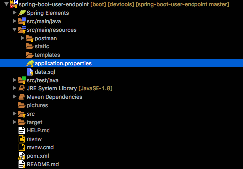

# Menu

* [Introduction](#introduction)
* [Port](#port)
* [Dependencies](#dependencies)
* [Database](#database)
* [Bean](#bean)
* [Repository](#repository)
* [User Controller](#user-controller)
	* [Create User](#create-user)
	* [Get All Users](#get-all-users)
	* [Get User By Id](#get-user-by-id)
	* [Get All Active](#get-all-active-users)
	* [Get Active By Id](#get-active-user-by-id)
	* [Update User](#update-user)
	* [Delete User](#delete-user)
	* [Activate User](#activate-user)
	* [Deactivate User](#deactivate-user)
* [Postman](#postman)


# Introduction

In this project you will find a small example with Spring Boot in which you will be able to perform CRUD oepraciones for users, as well as activate and deactivate them. All this in a very isolated way to a graphical interface, the way it will be done through endpoints that rest requests, which can be consumed from Postman or any other client that has the capacity to consume them.

[](#menu)

# Port

When we are working with Spring Boot, the default port in which our application runs is ___8080___. In case this we want to change this default port, we have to take in account the [application.properties](src/main/resources/application.properties) file, here we can made some important configurations.



```properties
spring.application.name=user-endpoint-service
server.port=8888
```
I've selected the ___8888___ port, this way, my microservice will run in the next urL:

[http://localhost:8888](http://localhost:8888)

[](#menu)

# Dependencies

[](#menu)

# Database

[](#menu)

# Bean

[](#menu)

# Repository

[](#menu)

# User Controller

[](#menu)

## Create User

[](#menu)

## Get All Users

[](#menu)

## Get User By Id

[](#menu)

## Get All Active Users

[](#menu)

## Get Active User By Id

[](#menu)

## Update User

[](#menu)

## Delete User

[](#menu)

## Activate User

[](#menu)

## Deactivate User

[](#menu)

# Postman

[](#menu)