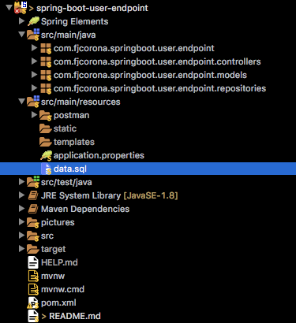

# _Menu_

* [_Introduction_](#introduction)
* [_Application Properties_](#application-properties)
	* [_Application Name_](#application-name) 
	* [_Port_](#port)
	* [_JPA Show SQL_](#jpa-show-sql)
	* [_JPA Format SQL_](#jpa-format-sql)
* [_Dependencies_](#dependencies)
	* [_Spring Boot Web Starter_](#spring-boot-web-starter)
	* [_Spring Boot Developer Tools_](#spring-boot-developer-tools)
	* [_Spring Boot Data JPA Starter_](#spring-boot-data-jpa-starter)
	* [_H2 Database Engine_](#h2-database-engine)
	* [_Spring Boot Test Starter_](#spring-boot-test-starter)
	* [_JUnit_](#junit)
* [_Database_](#database)
	* [_Database Feeding_](#database-feeding)
	* [_CREATE Query_](#create-query)
* [_Bean_](#bean)
	* [_Entity_](#entity) 
	* [_Column_](#column)
	* [_Primary Key_](#primary-key)
* [_Repository_](#repository)
* [_User Controller_](#user-controller)
	* [_Create User_](#create-user)
	* [_Get All Users_](#get-all-users)
	* [_Get User By Id_](#get-user-by-id)
	* [_Get All Active_](#get-all-active-users)
	* [_Get Active By Id_](#get-active-user-by-id)
	* [_Update User_](#update-user)
	* [_Delete User_](#delete-user)
	* [_Activate User_](#activate-user)
	* [_Deactivate User_](#deactivate-user)
* [_Postman_](#postman)

# _Introduction_

This project is especially focused on beginners, for all those who just want to know a quick and simple way to create microservices in spring boot.

Here you will find a small example in which you will be able to perform CRUD oepraciones for users, as well as activate and deactivate them. All this in a very isolated way to a graphical interface, the way it will be done through endpoints with REST requests, which can be consumed From any application or client that has the capacity to consume them. We will test the endpoints with Postman.

[](#menu)

# _Application Properties_

When we are working with Spring Boot, we have an [_application.properties_](src/main/resources/application.properties) file, here we can make some important configurations. There are some configurations which Spring Boot understand by default, but there are another ones that we have to explicity set in the file.

For this project we will set just four properties.

[](#menu)

## _Application Name_

The variable `spring.application.name` set the application name and indicates the name of the file in the GIT repository where the settings were sought.

This is the way to set the property at file:

```properties
spring.application.name=user-endpoint-service
```

[](#menu)

## _Port_

The default port in which a Spring Boot application runs is ___8080___. In the case we want to change this default port, we have to set `server.port` variable: 

```properties
server.port=8888
```

I've selected the ___8888___ port, this way, my microservice will run in the next URL:

[_http://localhost:8888_](http://localhost:8888)

[](#menu)

## _JPA Show SQL_

When the project is executed, there is a log, in which the errors are shown as well as some relevant information about our application. Thanks to the property `spring.jpa.show-sql` we have the possibility to see the queries related to our temporary database.

```properties
spring.jpa.show-sql=true
```

We just set the property as true, if we don't set this property, by default is false and no query is going to be shown. Later we will see some examples.

[](#menu)

## _JPA Format SQL_

This property works together with the previous property, because although, the previous property shows the queries, it doesn't make a nice format. That's where `spring.jpa.properties.hibernate.format_sql` comes into action to achieve that goal.

```properties
spring.jpa.properties.hibernate.format_sql=true
```

In the same way, this property by default is false, so we have to set as true.

Later we will see some examples of both properties working together.

[](#menu)

# _Dependencies_

As we can see at the structure, this project has been made under maven. That's why we need to add some dependencies to perform.

We can find those dependencies at [_pom.xml_](pom.xml)

[](#menu)

## _Spring Boot Web Starter_

Starter for building web, including RESTful, applications using Spring MVC. Uses Tomcat as the default embedded container.

```xml
<!-- https://mvnrepository.com/artifact/org.springframework.boot/spring-boot-starter-web -->
<dependency>
	<groupId>org.springframework.boot</groupId>
	<artifactId>spring-boot-starter-web</artifactId>
</dependency>
```

[](#menu)

## _Spring Boot Developer Tools_

Spring Boot includes an additional set of tools that can make the application development experience a little more pleasant. The spring-boot-devtools module can be included in any project to provide additional development-time features.

```xml
<!-- https://mvnrepository.com/artifact/org.springframework.boot/spring-boot-devtools -->
<dependency>
	<groupId>org.springframework.boot</groupId>
	<artifactId>spring-boot-devtools</artifactId>
	<scope>runtime</scope>
</dependency>
```

[](#menu)

## _Spring Boot Data JPA Starter_

Spring Boot Starters are a set of convenient dependency descriptors that you can include in your application. You get a one-stop-shop for all the Spring and related technology that you need without having to hunt through sample code and copy paste loads of dependency descriptors. For example, if you want to get started using Spring and JPA for database access just include the spring-boot-starter-data-jpa dependency in your project, and you are good to go.

```xml
<!-- https://mvnrepository.com/artifact/org.springframework.boot/spring-boot-starter-data-jpa -->
<dependency>
	<groupId>org.springframework.boot</groupId>
	<artifactId>spring-boot-starter-data-jpa</artifactId>
</dependency>
```

[](#menu)

## _H2 Database Engine_

H2 is a relational database management system written in Java. It can be embedded in Java applications or run in client-server mode.
It is possible to create both in-memory tables.

```xml
<!-- https://mvnrepository.com/artifact/com.h2database/h2 -->
<dependency>
	<groupId>com.h2database</groupId>
	<artifactId>h2</artifactId>
	<scope>runtime</scope>
</dependency>
```

[](#menu)

## _Spring Boot Test Starter_

Starter for testing Spring Boot applications with libraries including JUnit, Hamcrest and Mockito.

```xml
<!-- https://mvnrepository.com/artifact/org.springframework.boot/spring-boot-starter-test -->
<dependency>
	<groupId>org.springframework.boot</groupId>
	<artifactId>spring-boot-starter-test</artifactId>
	<scope>test</scope>
</dependency>
```

[](#menu)

## _JUnit_

JUnit is a regression testing framework written by Erich Gamma and Kent Beck. It is used by the developer who implements unit tests in Java. For the moment we will not be focused in testing.

```xml
<!-- https://mvnrepository.com/artifact/junit/junit -->
<dependency>
	<groupId>junit</groupId>
	<artifactId>junit</artifactId>
	<version>4.12</version>
	<scope>test</scope>
</dependency>
```

[](#menu)

# _Database_

As it was mentioned before ___H2 Engine___ is the _RDBMS_ we will use to persist our information. Due to it supplies us with the advantaje to make in-memory tables. It means that we don't really need to install nothing because we will have a Runtime database, which will be deleted once the execution of the application finishes. What doesn't mean a problem for learning effects. You should easily change H2 for annother database management such as ***MySQL*** or ***PostgreSQL***.

We make the assumption we are working with JPA.

[](#menu)

## _Database Feeding_

By default, spring boot reads the [_data.sql_](src/main/resources/data.sql) file located at ___resources___ folder to create our temporal database.



It is as simple as declare `INSERT` queries with the table, the fields and the info we need:

```sql
INSERT INTO users (usr_id, usr_name, usr_lastname, usr_age, usr_active)
VALUES (10001, 'Javier', 'Corona', 30, 1);
INSERT INTO users (usr_id, usr_name, usr_lastname, usr_age, usr_active)
VALUES (10002, 'Francisco', 'Sánchez', 29, 1);
INSERT INTO users (usr_id, usr_name, usr_lastname, usr_age, usr_active)
VALUES (10003, 'Alejandra', 'López', 25, 0);
INSERT INTO users (usr_id, usr_name, usr_lastname, usr_age, usr_active)
VALUES (10004, 'Fernanda', 'Parra', 32, 1);
INSERT INTO users (usr_id, usr_name, usr_lastname, usr_age, usr_active)
VALUES (10005, 'Humberto', 'Lisboa', 22, 1);
INSERT INTO users (usr_id, usr_name, usr_lastname, usr_age, usr_active)
VALUES (10006, 'Paola', 'Duarte', 33, 1);
INSERT INTO users (usr_id, usr_name, usr_lastname, usr_age, usr_active)
VALUES (10007, 'Ernesto', 'Duarte', 33, 0);
INSERT INTO users (usr_id, usr_name, usr_lastname, usr_age, usr_active)
VALUES (10008, 'Filemón', 'Hernández', 25, 0);
INSERT INTO users (usr_id, usr_name, usr_lastname, usr_age, usr_active)
VALUES (10009, 'Pantaleón', 'Pérez', 23, 1);
INSERT INTO users (usr_id, usr_name, usr_lastname, usr_age, usr_active)
VALUES (10010, 'Serafino', 'Arriaga', 44, 1);
```

[](#menu)

## _CREATE Query_

Once the application is executed, the SQL file before fed, is read, and according to the names and values ​​given in the `INSERT` queries, a ___users___ table is created with the fields and their respective data types. The next `CREATE` query is internally exectuted:

```sql
DROP TABLE users IF EXISTS
CREATE TABLE users (
	usr_id INTEGER GENERATED BY DEFAULT AS IDENTITY,
	usr_active INTEGER NOT NULL,
	usr_age INTEGER NOT NULL,
	usr_lastname VARCHAR(255) NOT NULL,
	usr_name VARCHAR(255) NOT NULL,
	PRIMARY KEY (usr_id)
)
```

We can check it with the following screenshot of the log, where we can see how the table is created using ___Hibernate___

Remember we can see it due to `spring.jpa.show-sql` and `spring.jpa.show-sql` has been set as _true_.


As it was mentioned, data types are made according to the values they are feed wit. We can observe too that `VARCHAR` fields get by default 255 length.
The definition of the files as `NOT NULL` or `PRIMARY KEY`are not from the SQL file, but there are from the abbotations in the been, as we will see in the nest section.

[](#menu)

# _Bean_

Now we need a Bean, I mean, a Java class which will be mapped with the database `users` table. So well need such class with the same or similar name than the table, and properties related with the fields of the table. Of course we need a property by each field, with the same data types, and the same or similar name.

Besides that, the class has to have the getters and setters methods. They are not included in the below definition of code. But you can find the complete code in [_User.java_](src/main/java/com/fjcorona/springboot/user/endpoint/models/User.java) file.

In this bean we use some annotations form `javax.persistence`package.

```java
package com.fjcorona.springboot.user.endpoint.models;

import javax.persistence.Column;
import javax.persistence.Entity;
import javax.persistence.GeneratedValue;
import javax.persistence.GenerationType;
import javax.persistence.Id;
import javax.persistence.Table;

@Entity
@Table(name = "users")
public class User {

	@Id
	@GeneratedValue(strategy = GenerationType.IDENTITY)
	@Column(name = "usr_id", nullable = false)
	private Integer id;

	@Column(name = "usr_name", nullable = false)
	private String name;

	@Column(name = "usr_lastname", nullable = false)
	private String lastname;

	@Column(name = "usr_age", nullable = false)
	private Integer age;

	@Column(name = "usr_active", nullable = false)
	private Integer active;

	public User() {
	}

	/*
	 * Insert Getters, Setters and Constructors Here
	 * /

}
```

[](#menu)

## _Entity_

`@Entity` annotation defines that a class can be mapped to a table. Table name is derived from entity class name, it means that, for example, in this case due to the name ___User___ of the clase, JPA automatically would try to match with a ***user*** table, but our table is called _**users**_, in plural, in this case we have to explicity indicate to the class, which table has to map, this is possible through `@Table` annotation:

```java
@Table(name = "users")
public class User {
	// Code here
}
```

This way ___User___ class knows that is mapped with ***users*** table.

[](#menu)

## _Column_

In the same way table's columns are derived from entities properties, so by default JPA will look for the names of your properties as fields of the table you indicate the Entity it is. As you can see, in the database the fields names has an **usr_** prefix that the class properties don't have, son we need the `@Column` annotation to explicity indicate property by property which field tables will be linked with.

```java
@Column(name = "usr_name", nullable = false)
private String name;
```

This way, ___name___ property knows that is mapped with ***usr_name*** field. And so for each _property/field_ pair.

You might think that the best would be for the table to have the same name as the class and that the fields should also have the same name as the properties and thus avoid these two optional annotations in our code. And maybe that is the best solution, but the difference of names has been made purposely for didactic purposes.

For this annotation there is another point that I would like to emphasize, you can see that in addition to name, another parameter `nullable = false` is being sent, this is what results in the fields of our temporary table being created as `NOT NULL`.

[](#menu)

## _Primary Key_

The `@Id` annotation is inherited from javax.persistence.Id indicating the member field below is the ___primary key___ of current entity.

The `@GeneratedValue` annotation is to configure the way of increment of the specified ___primary key___.

The `GenerationType.IDENTITY` is the easiest strategy to use. It relies on an auto-incremented database column and lets the database generate a new value with each insert operation.

This both annotations together, will supplies us with and ___id___ autoincremental primary key:

```java
@Id
@GeneratedValue(strategy = GenerationType.IDENTITY)
@Column(name = "usr_id", nullable = false)
private Integer id;
```
An they both are the reason osf the primary key in create quey we've seen before.

Something we have to consider and never forget is that the `@Entity` annotation, together with `@Id` annotation is the minimum we need in order to create an entity.

[](#menu)

# _Repository_


# _User Controller_


## _Create User_


## _Get All Users_


## _Get User By Id_


## _Get All Active Users_


## _Get Active User By Id_


## _Update User_


## _Delete User_


## _Activate User_


## _Deactivate User_


# _Postman_


