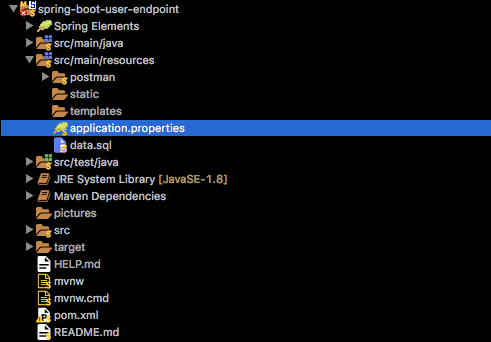

# _Menu_

* [Introduction](#introduction)
* [Port](#port)
* [Dependencies](#dependencies)
	* [Spring Boot Data JPA Starter](#spring-boot-data-jpa-starter)
	* [Spring Boot Web Starter](#spring-boot-web-starter)
	* [Spring Boot Developer Tools](#spring-boot-developer-tools)
	* [H2 Database Engine](#h2-database-engine)
	* [Spring Boot Test Starter](#spring-boot-test-starter)
	* [JUnit] (#junit)
* [Database](#database)
* [Bean](#bean)
* [Repository](#repository)
* [User Controller](#user-controller)
	* [Create User](#create-user)
	* [Get All Users](#get-all-users)
	* [Get User By Id](#get-user-by-id)
	* [Get All Active](#get-all-active-users)
	* [Get Active By Id](#get-active-user-by-id)
	* [Update User](#update-user)
	* [Delete User](#delete-user)
	* [Activate User](#activate-user)
	* [Deactivate User](#deactivate-user)
* [Postman](#postman)


# _Introduction_

This project is especially focused on beginners, for all those who just want to know a quick and simple way to create microservices in spring boot.

Here you will find a small example in which you will be able to perform CRUD oepraciones for users, as well as activate and deactivate them. All this in a very isolated way to a graphical interface, the way it will be done through endpoints that rest requests, which can be consumed from Postman or any other client that has the capacity to consume them.

[](#menu)

# _Port_

When we are working with Spring Boot, the default port in which our application runs is ___8080___. In case this we want to change this default port, we have to take in account the [_application.properties_](src/main/resources/application.properties) file, here we can made some important configurations.



```properties
spring.application.name=user-endpoint-service
server.port=8888
```
I've selected the ___8888___ port, this way, my microservice will run in the next urL:

[_http://localhost:8888_](http://localhost:8888)

[](#menu)

# _Dependencies_

As we can see at the structe, this project has been made under maven. That's why we need to add some dependencies to perform.

We can find those dependencies at [_pom.xml_](pom.xml)

[](#menu)

## _Spring Boot Data JPA Starter_

```xml
<!-- https://mvnrepository.com/artifact/org.springframework.boot/spring-boot-starter-data-jpa -->
<dependency>
	<groupId>org.springframework.boot</groupId>
	<artifactId>spring-boot-starter-data-jpa</artifactId>
</dependency>
```

[](#menu)

## _Spring Boot Web Starter_

```xml
<!-- https://mvnrepository.com/artifact/org.springframework.boot/spring-boot-starter-web -->
<dependency>
	<groupId>org.springframework.boot</groupId>
	<artifactId>spring-boot-starter-web</artifactId>
</dependency>
```

[](#menu)

## _Spring Boot Developer Tools_

```xml
<!-- https://mvnrepository.com/artifact/org.springframework.boot/spring-boot-devtools -->
<dependency>
	<groupId>org.springframework.boot</groupId>
	<artifactId>spring-boot-devtools</artifactId>
	<scope>runtime</scope>
</dependency>
```

[](#menu))

## _H2 Database Engine_

```xml
<!-- https://mvnrepository.com/artifact/com.h2database/h2 -->
<dependency>
	<groupId>com.h2database</groupId>
	<artifactId>h2</artifactId>
	<scope>runtime</scope>
</dependency>
```

[](#menu)

## _Spring Boot Test Starter_

```xml
<!-- https://mvnrepository.com/artifact/org.springframework.boot/spring-boot-starter-test -->
<dependency>
	<groupId>org.springframework.boot</groupId>
	<artifactId>spring-boot-starter-test</artifactId>
	<scope>test</scope>
</dependency>
```

[](#menu)

## _JUnit_

```xml
<!-- https://mvnrepository.com/artifact/junit/junit -->
<dependency>
	<groupId>junit</groupId>
	<artifactId>junit</artifactId>
	<version>4.12</version>
	<scope>test</scope>
</dependency>
``` 


# _Database_

[](#menu)

# _Bean_

[](#menu)

# _Repository_

[](#menu)

# _User Controller_

[](#menu)

## _Create User_

[](#menu)

## _Get All Users_

[](#menu)

## _Get User By Id_

[](#menu)

## _Get All Active Users_

[](#menu)

## _Get Active User By Id_

[](#menu)

## _Update User_

[](#menu)

## _Delete User_

[](#menu)

## _Activate User_

[](#menu)

## _Deactivate User_

[](#menu)

# _Postman_

[](#menu)